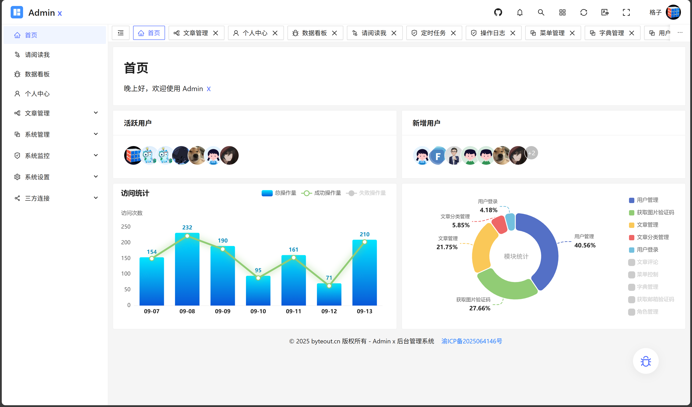

# admin-x-server

>一个全场景企业级后台管理模板，集成表单、富文本、可视化图表（ECharts）、拖拽布局、动态表格联动等核心功能，采用模块化设计支持快速扩展，适用于中后台系统开发与前端技术栈实践。技术栈：Spring Boot + Redis + MySQL

# 演示地址
https://byteout.cn

> 点击链接加入群聊【Admin x 大暑版】：https://qm.qq.com/q/KCSI9GMiE8

- Javadoc 标签

| 标签            | 用途      | 示例                                 |
|---------------|---------|------------------------------------|
| `@author`     | 作者信息    | `@author byte-scheduler`           |
| `@since`      | 创建时间/版本 | `@since 2025/5/14`                 |
| `@see`        | 相关参考	   | `@see UserLoginRequest`            |
| `@deprecated` | 标记废弃	   | `@deprecated 请使用新版`                |
| `@param`      | 方法参数说明	 | `@param username 用户名`              |
| `@return`     | 返回值说明	  | `@return 操作结果`                     |
| `@throws`     | 异常说明	   | `@throws IllegalArgumentException` |
| `@apiNote`    | 额外说明	   | `@apiNote 仅限管理员使用`                 |

# build
```shell
# build
mvn clean package -Dmaven.test.skip=true
```

